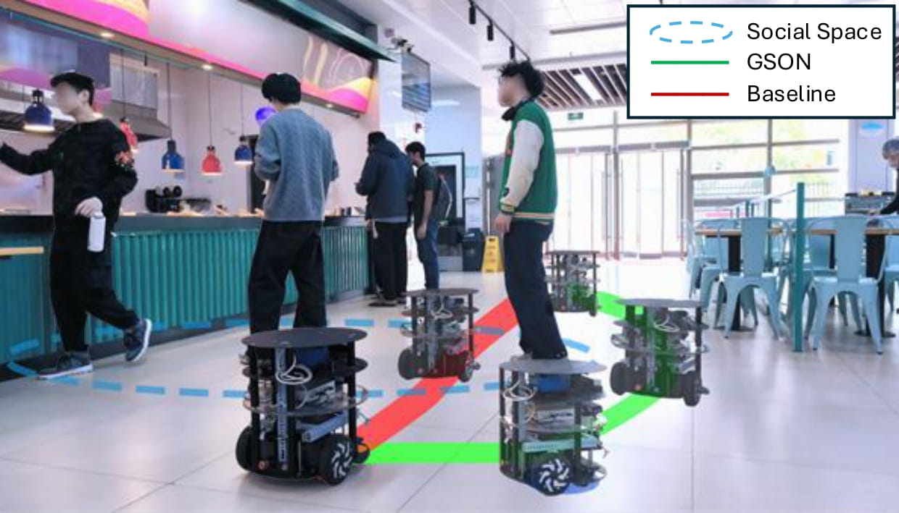

# GSON  Group-based Social Navigation Framework with Large Multimodal Model

<p align="center">
    
</p>

<p align="center">
  [<a href="https://arxiv.org/abs/2409.18084">Read our arXiv Paper</a>]
</p>

> This paper introduces GSON, a novel group-based social navigation framework that leverages Large Multimodal Models (LMMs) to enhance robots’ social perception capabilities. Our approach uses visual prompting to enable zero-shot extraction of social relationships among pedestrians and integrates these results with robust pedestrian detection and tracking pipelines to overcome the inherent inference speed limitations of LMMs. 


## News
- **2025.07.29**: Our work has been accepted to RA-L ! 

## Quick Start
### Prerequisites
GSON is developed based on `ubuntu 20.04`, `python=3.8`,`pytorch=1.11.0`,`ros-noetic`.

### Installation
1. create a catkin workspace:
```bash
mkdir -p catkin_ws/src
cd catkin_ws/src
git clone --recursive https://github.com/lsylsy0516/GSON.git && cd GSON
```

2. `conda` is recommand to setup virtual python environment:
```
conda create -n gson python=3.8
conda activate gson
pip install rospkg
pip install -r ./third_party/yolov5_ros/src/yolov5/requirements.txt
cd ./third_party/2D_lidar_person_detection/dr_spaam
pip install .
```

3. compile gson with 
```
cd ~/catkin_ws
catkin_make -DPYTHON_EXECUTABLE=/usr/bin/python3
```

4. you need to download the necessary weight file for **2D LiDAR Ped detection**.In GSON ,we use `ckpt_jrdb_ann_drow3_e40.pth`. Download it from [here](https://drive.google.com/drive/folders/1Wl2nC8lJ6s9NI1xtWwmxeAUnuxDiiM4W?usp=sharing) and place it in `third_party/2D_lidar_person_detection/dr_spaam_ros/config/`

5. Some source files in GSON contain hardcoded Python shebangs (e.g., `#!/home/luo/miniconda3/envs/gson/bin/python3`), as well as `#!/usr/bin/python3` in` catkin_ws/devel/lib/yolov5_ros/detect.py`. You need to replace these with the path to your own Conda environment's Python interpreter.

## Third-party Code and Licenses

This repository incorporates and modifies code from the following open-source projects:

- [`yolov5_ros`](https://github.com/mats-robotics/yolov5_ros) (GPLv3):  
  Used for YOLOv5-based pedestrian detection in ROS.  See `third_party/yolov5_ros/`.

- [`2D_lidar_person_detection`](https://github.com/VisualComputingInstitute/2D_lidar_person_detection) (GPLv3):  
  Used for LiDAR-based person detection.See `third_party/2D_lidar_person_detection/`.